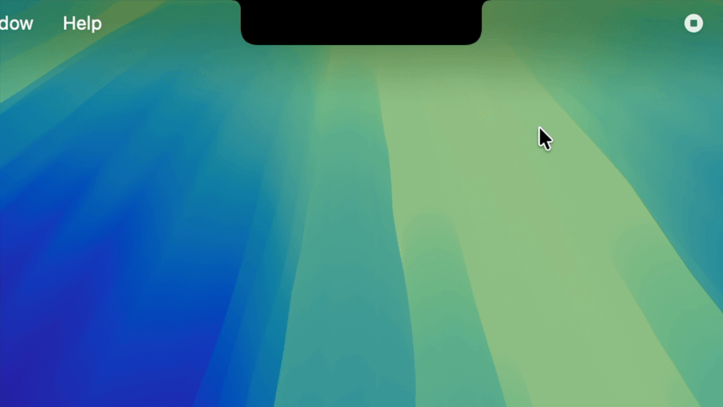
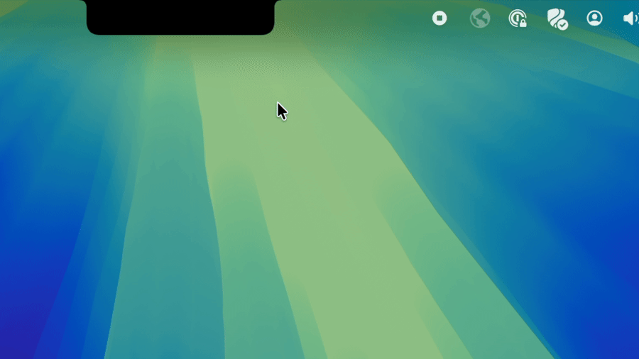

<div align="center">



# Pookify 🐼

The Claude Code dynamic Island for your MacBook.

</div>


## Install

**1. Clone the repo**

```bash
git clone https://github.com/eyadhammouda/pookify
cd pookify
```

**2. Build and install**

```bash
./scripts/install.sh
```

This adds Pookify to your Applications and sets up Claude Code. Start a session and the island shows up on your notch.

## Claude icons

Right-click the island to switch between **Clawd** (the crab, default) and the **Spark**.



## What it shows

- Working: the Claude mark animates with a live turn timer and the current activity — Thinking, Reading (with the file name), Editing, Running command, Searching, Browsing web, Planning, Delegating, Compacting, and more.
- Awaiting permission: the island turns amber and opens so you notice it.
- Done: a check, then it retracts into the notch.

Several sessions fold into one island. A session waiting on your approval takes priority over one that is only working.

## Where it works

- ✅ Claude Code in the terminal
- ✅ Claude Code in the VS Code extension

## How it works

Claude Code runs a hook each time something happens (a tool starts, a tool finishes, a turn ends, a prompt needs approval). A small compiled helper, `island-hook`, writes that session's status to a JSON file under `~/Library/Application Support/Pookify/state.d/`. The app checks that folder a few times a second, folds every live session into one decision, and draws the notch.

The installer adds its hooks to `~/.claude/settings.json`, backs the file up first, and leaves your other hooks and settings alone.

To preview every state without running an agent, see [DEMO.md](DEMO.md).

## Uninstall

```bash
./scripts/uninstall.sh
```

Removes the app and its hooks. Your config backup (`settings.json.bak-pookify`) stays in place.

## Limitations

- The notch effect needs a notched Mac (14-inch or 16-inch MacBook Pro, or a notched MacBook Air). On other displays it shows a floating bar at the top center.

## Privacy

Pookify runs entirely on your Mac. It makes no network calls and collects no analytics. See [PRIVACY.md](PRIVACY.md).

## Trademark and affiliation

Pookify is an independent, unofficial, open-source project. It is not affiliated with, endorsed by, or sponsored by Anthropic or Apple.

Product names and logos belong to their owners and are used here only to say what Pookify works with:

- "Claude", "Claude Code", and the Claude spark logo are trademarks of Anthropic, PBC.
- "Dynamic Island", "MacBook", and "macOS" are trademarks of Apple Inc. Pookify is a notch status display in the style of the Dynamic Island; it is not Apple's product.

The MIT license covers Pookify's source code only and grants no rights to any third-party trademark, logo, or brand. See [TRADEMARKS.md](TRADEMARKS.md). Bundled third-party material (the claude-status-bar artwork under MIT) is credited in [THIRD_PARTY_NOTICES.md](THIRD_PARTY_NOTICES.md), which also ships inside the app. If you are a rights holder and want a mark removed, open an issue and it will be handled promptly. This is a free, non-commercial project.

## License

MIT. See [LICENSE](LICENSE).
